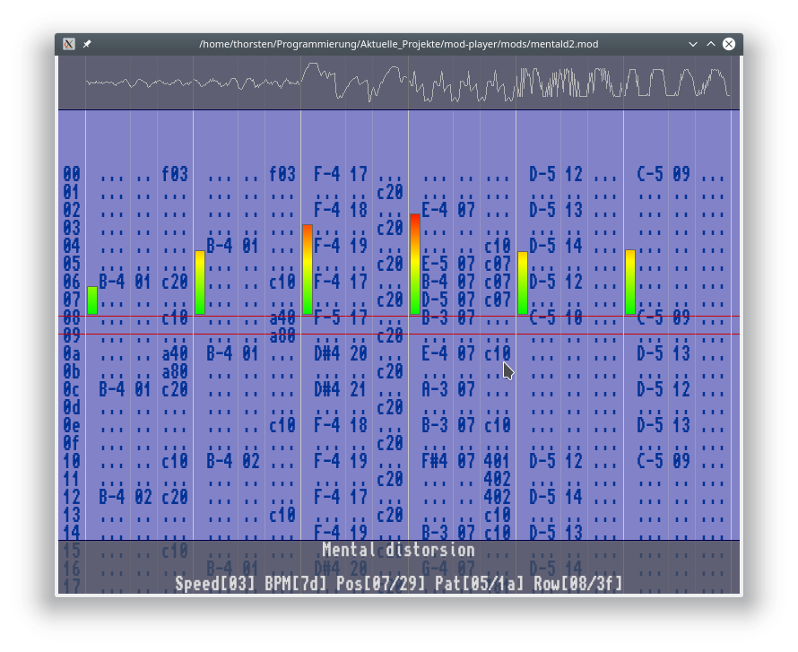

# MOD Player with SDL2
## This is a MOD Player for *.mod files only, with variable counts of sound channels
### [Latest version here](https://github.com/ThKattanek/mod-player/releases/latest)


### [For many mods -- The Mod Archive](https://modarchive.org)

## Screenshot


## Used libraries
* SDL2
* SDL2_ttf

## Used fonts by Marcus Hoffren
https://github.com/rewtnull/amigafonts

## Build
```bash
git clone https://github.com/ThKattanek/mod-player.git
cd mod-player
mkdir build
cd build
cmake .. -DCMAKE_BUILD_TYPE=Release
make
make install
```
Optionaly -DCMAKE_INSTALL_PREFIX=[InstallPfad] can be used.

## Uninstall
```bash
xargs rm < install_manifest.txt
```
Warning! Directories created by the installation are not removed, but only all files created.

## Compiling for Windows x32 with MXE (Crossdev)
```bash
cd ~
git clone https://github.com/ThKattanek/mod-player.git
cd mod-player
mkdir build-win-x32
cd build-win-x32
[MXE-PATH]/usr/bin/i686-w64-mingw32.static-cmake .. -DWIN32_STATIC_BUILD=TRUE -DCMAKE_INSTALL_PREFIX=../install-win-x32
make
make install
```
## Compiling for Windows x64 with MXE (Crossdev)
```bash
cd ~
git clone https://github.com/ThKattanek/mod-player.git
cd mod-player
mkdir build-win-x64
cd build-win-x64
[MXE-PATH]/usr/bin/x86_64-w64-mingw32.static-cmake .. -DWIN32_STATIC_BUILD=TRUE -DCMAKE_INSTALL_PREFIX=../install-win-x64
make
make install
```
## Complete build and create the windows versions (32/64bit) as 7zip with Script (crossbuild-win-releases.sh)
#### MXE required
```bash
cd ~
git clone https://github.com/ThKattanek/mod-player.git
cd mod-player
./crossbuild-win-releases.sh [MXE-PATH]
```
### [MXE Website](http://mxe.cc)
